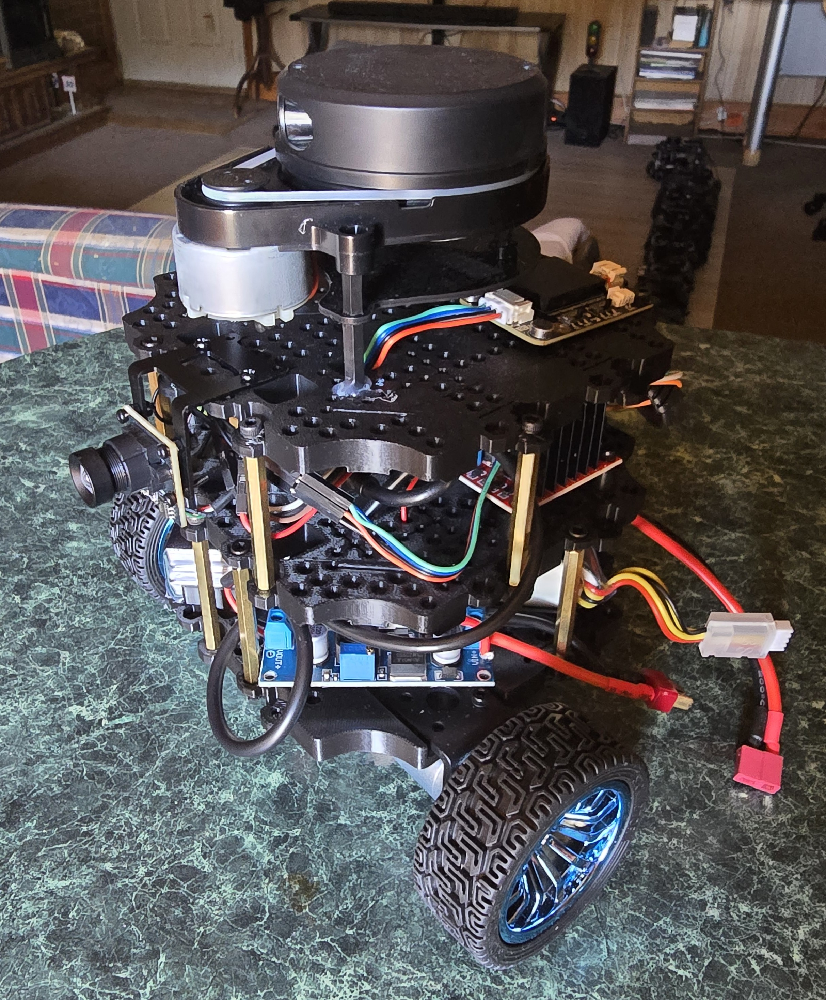

# NoirBot

ROS2 Jazzy workspace for my Noirbot, concentrating on C++ programming.



## Hardware

- Raspberry Pi 5, Ubuntu 24.04, ROS2 Jazzy
- Arduino (CH340 USB serial) running PID wheel-velocity firmware
- YDLIDAR X4 Pro (CP2102 USB adapter board)
- MPU IMU and DFRobot DF2301Q voice sensor on I2C
- USB camera

## Packages

| Package | Purpose |
| --- | --- |
| `noirbot_description` | URDF/xacro, meshes, ros2_control description |
| `noirbot_firmware` | `NoirInterface` ros2_control hardware plugin (serial to Arduino) |
| `noirbot_bringup` | Launch files, controller config, lidar config |

## Setup on a fresh install

### 1. Clone this repo

```bash
mkdir -p ~/noirbot_ws
cd ~/noirbot_ws
git clone git@github.com:Dwilliestyle/Noir-Bot.git src
```

### 2. YDLIDAR SDK (system-wide, outside the workspace)

```bash
sudo apt install -y cmake pkg-config build-essential
cd ~
git clone https://github.com/YDLIDAR/YDLidar-SDK.git
cd YDLidar-SDK
mkdir build && cd build
cmake ..
make
sudo make install
```

### 3. Lidar ROS2 driver

Not part of this repo (it is in `.gitignore`). Clone it into `src`:

```bash
cd ~/noirbot_ws/src
git clone https://github.com/VirtusCo/ydlidar-ros2-driver.git
```

The package it provides is `ydlidar_driver`, with the node `ydlidar_node`.

### 4. udev rules for stable device names

Gives `/dev/lidar` and `/dev/arduino`, so the two USB serial devices can
enumerate in any order.

```bash
sudo tee /etc/udev/rules.d/99-noirbot.rules << 'EOF'
SUBSYSTEM=="tty", ATTRS{idVendor}=="10c4", ATTRS{idProduct}=="ea60", SYMLINK+="lidar", MODE="0666"
SUBSYSTEM=="tty", ATTRS{idVendor}=="1a86", ATTRS{idProduct}=="7523", SYMLINK+="arduino", MODE="0666"
EOF
sudo udevadm control --reload-rules
sudo udevadm trigger
sudo udevadm settle
ls -l /dev/lidar /dev/arduino
```

### 5. Raise the Pi 5 USB current limit

Without this, running the lidar, Arduino and camera together trips the Pi's
USB over-current protection and all USB devices drop out
(`Serial write failed` from NoirInterface).

```bash
echo "usb_max_current_enable=1" | sudo tee -a /boot/firmware/config.txt
sudo reboot
```

Check with `vcgencmd get_config usb_max_current_enable`.

### 6. Build

```bash
cd ~/noirbot_ws
colcon build
source install/setup.bash
```

## Running

Whole robot (drive interface, controllers and lidar):

```bash
ros2 launch noirbot_bringup noirbot.launch.py
```

Lidar only:

```bash
ros2 launch noirbot_bringup lidar.launch.py
```

## Lidar notes (X4 Pro)

Config: `noirbot_bringup/config/ydlidar_x4pro.yaml`

- Port `/dev/lidar`, 128000 baud, frame `laser_link`
- `singleChannel: true` (`false` gives health and timeout errors)
- `support_motor_dtr_ctrl: false` (`true` slows the motor and `/scan` drops to about 3.6 Hz)
- Parameter names are this driver's own (`min_range`, `max_range`,
  `samp_rate`, `resolution_fixed`, `singleChannel`, `support_motor_dtr_ctrl`),
  not the ones in YDLIDAR's stock YAML files. Unknown names are silently ignored.
- The top-level YAML key must be `ydlidar_node`.

## Troubleshooting

- USB devices dropping out: `sudo dmesg | grep -i over-current`
- Supply check: `vcgencmd get_throttled` (want `0x0`) and `vcgencmd pmic_read_adc EXT5V_V`
- Scan rate: `ros2 topic hz /scan` (want about 10 Hz)